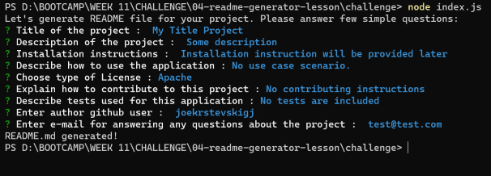
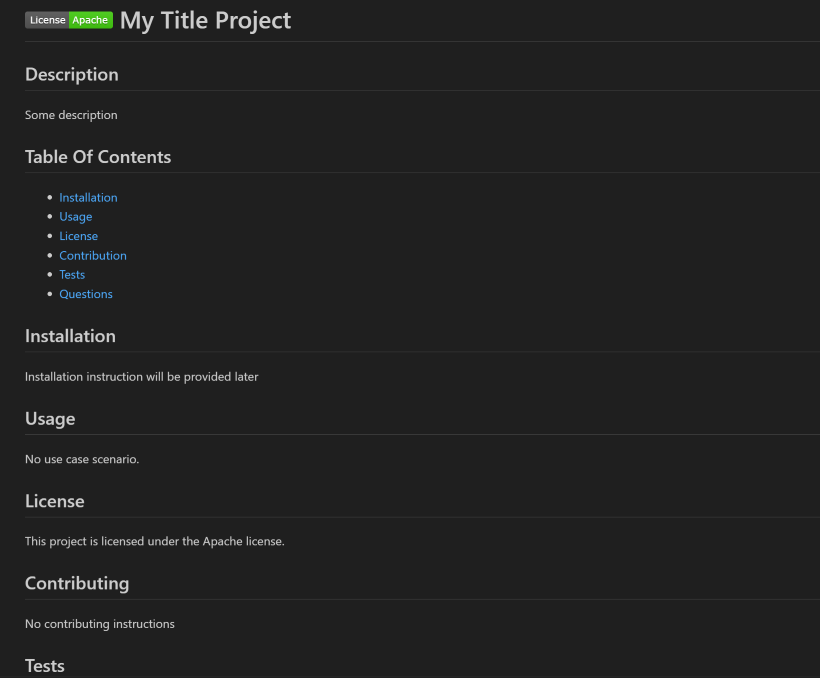

# README.md Generator
A console application that generates a README.md file.

## Instructions
To run this application, you'll need to installed node.js on your machine. Open command prompt and type `node -v` to check if node.js is already installed. If not, you can follow this [link](https://nodejs.org/en) to installed it.

Once installed, clone or download this project. Open command prompt at the same location and type `node index.js` to run it.

After answering a several question about the project, the application will generate the README.md file in the same folder as the index.js file.

### Screenshot 1 ###
A preview of the console application

### Screenshot 2 ###
A preview of the generated README.md file.

